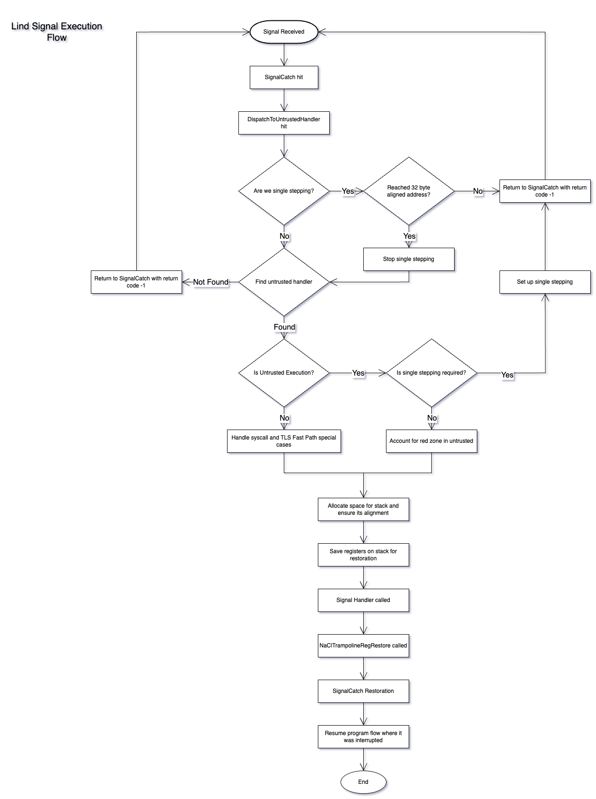

# Background Context
Native Client (NaCl) is a sandboxing technology for running untrusted code safely. Native Client did not directly support handling signals in the traditional sense like POSIX systems do.
To support signals for the Lind project, NaCl code has been modified and extended. 
This implementation even allows signal handling by untrusted code with custom handlers. It focuses on handling signals received by the program and determining whether they should be handled by trusted (NaCl) code or by untrusted code with custom handlers.
The architecture ensures proper handling and restoration of context when signals are received in an untrusted environment, considering various edge cases and security implications.

# Components
### SignalCatch
`SignalCatch` is registered to handle signals and initializes the signal context, determining whether the signal was caught in trusted or untrusted code. It is the central handler for caught signals. It also restores registers based on trusted/untrusted context.\
`SignalCatch` restoration: Restores registers based on trusted/untrusted context. For trusted code, returns to the exact point of interruption. \
Untrusted handler return: `NaClTrampolineRegRestore` called.

### DispatchToUntrustedHandler
Decides if the signal should be handled by untrusted code since they have different handling paths.\
It checks whether we can dispatch the signal to an untrusted exception handler.  If we can, it modifies the register state to call the handler and writes a stack frame into untrusted address space, and returns true.  Otherwise, it returns false.\
It prepares for executing untrusted signal handlers, handling special cases such as syscall entry/exit points and TLS fast path functions.

### NaClTrampolineRegRestore
This function is implemented for handling return from untrusted code. It restores registers after execution of signal handler.\
It is executed upon returning from an untrusted signal handler, and does tasks like resetting signal masks and restoring registers, with special considerations for the instruction pointer's restoration and ensures secure transition back to untrusted code after a signal handler finishes execution. 

# Key Facts
### 32 Byte Alignment & Single Stepping
NaCl's security model requires 32-byte alignment for jump targets. This serves the practical purpose of preventing the user from jumping into the middle of an instruction. Because we may, after running a signal handler, return to the point of last execution as specified by a field on the stack, and because the user can modify this at will, it is important for us security-wise to return to 32 byte aligned addresses.\
To enforce this, a mechanism using the TRAP flag in x86 architecture is employed, allowing single-stepping until reaching a 32-byte aligned instruction.\
**Using TRAP to force signal receiving at 32 byte boundary**: The TRAP flag in x86 (`0x100` in `EFLAGS`) is set when we receive a signal at an untrusted instruction of an offset not divisible by 32, thus causing every subsequent instruction to raise a SIGTRAP signal, allowing us to single step the processor until we reach a 32 byte aligned instruction address, at which point the TRAP flag is unset and we are able to run the untrusted signal handler as if the signal was received there.\
Side note: If single stepping happens within the program, gdb and rr may show weird behavior and make debugging difficult.\

### Stack Handling
Registers are deposited on the stack for restoration upon return from the signal handler. Different handling is required based on whether the signal was caught in trusted or untrusted code, due to different register sets. \
Red zone and struct sizes are also considered during stack handling.

# Summarized Flow
1. Signal Caught.
2. Signal received by untrusted code.
3. SignalCatch triggered.
4. DispatchToUntrustedHandler triggered:
5. Check for single-stepping and alignment
6. If no untrusted handler: Signal remains unhandled
7. If untrusted handler exists: Set up single-stepping if needed
8. Handle special cases for trusted code.  (e.g., system calls)
9. For untrusted, save registers on stack for restoration.
10. Untrusted Handler Execution: Untrusted code runs the signal handler.
11. Returning from Handler: NaClTrampolineRegRestore called.\
    Resets signal mask and untrusted bookkeeping.\
    Restores all registers from stack except rip.\
    Restores rip from r14 register (reserved for this purpose).
12. SignalCatch Restoration: \
    For Trusted code: Restores all registers and returns to exact interruption point.\
    For Untrusted code: Restores rip and rsp (masked to 32-byte boundaries), returns to handler start.

# Diagram

# Detailed Flow
1. Signal handler `SignalCatch` registered in `NaClSignalHandlerInit`. \
Sets a sigmask containing all NaCl handled signals on signal receipt.
2. `SignalCatch` sets up the `sig_ctx` field and the `is_untrusted` variable.\
`sig_ctx` contains the register state of the program when the signal was received.\
`is_untrusted` contains information about whether the instruction pointer was in trusted or untrusted code when the signal was received.
3. `SignalCatch` checks if the signal is user-generated.
4. `SignalCatch` calls the `DispatchToUntrustedHandler` function.\
This does the setup work for execution of an untrusted handler, finding the register state that we want to set to execute the untrusted handler and allow returning from it.\
    - If we are single stepping and we’ve reached a 32 byte aligned address, stop single stepping by unsetting the TRAP flag in untrusted and bookkeeping in the `natp`.\
    If we are single stepping but haven’t reached a 32 byte aligned address yet, return `-1` to indicate that we wish to return from `SignalCatch` immediately after copying out register state. This will cause the sigreturn syscall to be executed which restores the flags register from the copied out values including the trap flag which remains there.\
    - If there is no untrusted handler in the signal received, return and indicate to `SignalCatch` to treat the signal as unhandled which for us means terminate. \
    This should change in the future when we actually handle signal disposition. This untrusted handler is stored as an address in Rust.\
    - If we're in untrusted code, we need to check if we need to activate single stepping mode which is handled by setting the `SIGTRAP` flag in the user space registers, and doing some `natp` bookkeeping and then returning.\
    - Special cases: Signal received while executing trusted code needs to be handled carefully due to a large number of edge cases.
        + The first is simply if we receive a signal in the first few instructions of a syscall, we can not rely on the `natp` being properly populated. 
        + Second, if we receive a signal in the last few instructions of a syscall, we may have already made some decisions on what to spit out to untrusted which may have been made differently had the signal occurred already so we need to rerun the system call exit code.
        + The other two special cases involve the functions `NaClGetTlsFastPath1` and `NaClGetTlsFastPath2`. 
        These functions have a special pathway into trusted code from any other syscall, and thus must be handled separately. Additionally, they modify the stack pointer halfway through so we must account for that as well. All of these special cases are signified by the lack of the `natp->signatpflag` which is a flag that is set whenever the `natp` in a normal syscall is prepared for a signal receive and has not yet had any parts of it copied out. \
        We determine which case is which of the four aforementioned special cases by statically checking the address of the instruction pointer against the known bounds of these functions.\
        For all but the tls syscall cases we must set the `natp->signalpending` flag which signifies that we must be aware that a signal handler is the next untrusted code to be executed on exit from trusted code, and decisions are made based on it in `NaClSwitchToApp`.
        + After we handle those special cases we must deposit the untrusted registers on the stack for restoration upon return from the signal handler. However, we must respect the red zone of the stack as well as allocate enough space to store these registers in the struct `NaClExceptionFrame`. 
When the signal is caught in untrusted code the registers we want to restore are in the `regs` variable copied out from the `ucontext` field. However, when the signal is caught in trusted code, we only want to restore the callee save registers in the `natp`. We may also want to send the return value of the syscall in `rax` back to untrusted upon signal handler return. After this, practically all the relevant information is set up for signal handling, and we return to `SignalCatch`
5. `SignalCatch` then does the restoration to the previous point of execution.\
If the `DispatchToUntrustedHandler` returned successfully, it does different things for untrusted and trusted code and for tls fast path function cases.\
For the TLS fast path function cases, it just puts the untrusted handler address into the register whose value is the address returned to at the end of the tls fast path functions and restores all relevant registers' values to what they are in the regs field and return execution to where the signal was received by restoring the callee saved registers and rip. \
For untrusted code, we restore only the registers relevant to the handler - these being `rip` and `rsp` for obvious reasons and `rdi` to store the first argument, the signal number. We don't support the extended signal return arguments in lind yet so we don't need to handle a `siginfo_t` or anything. 
For trusted code we restore every single register and then return execution to the point in trust we were stopped at.
6. In trusted execution, when the syscall a signal was received in wishes to return, it calls `NaClSwitchToApp` which in turn calls `NaClmaskRestore` which in case the `pendingsignal` flag is set unsets it and modifies the `rax` value to be restored on signal handler return based on the syscall return value.
7. Returning from an untrusted signal handler:
This function's address is put onto the stack immediately under the signal handler's stack frame such that it is called as soon as the untrusted signal handler returns. This function is loaded into the trampoline at `NaClPatchRegTrampolineCall` called from `sel_ldr.c`, and lives in cage memory. First it calls into another trampoline entry for `NaClSysSigmaskSigreturn` which resets the `sigprocmask` of the thread which was set by `sigaction`, and also unsets some `natp` bookkeeping.\
After that it restores all registers to the values they should be in untrusted. However this created an issue – when we wanted to restore to the previous untrusted state we had to be at a point where every register contains the correct value for the untrusted state except for the instruction pointer. The question then arises, where is the instruction pointer to be restored from? The answer is either a static address, on the untrusted stack, a fixed trusted address, or nowhere. It may be possible to store some sort of protected thread local stack data structure for address of received signals but as the fixed trusted address can't handle multiple signals called on top of each other and the untrusted address leaves us very vulnerable to TOCTTOUs, we decided that we had little choice but to reserve the `r14` register expressly for this purpose – any use of it within untrusted code is undefined.\
The `rip` and `rsp` values are importantly masked to 32 byte aligned addresses, and the flags register is masked on the stack (although this is pretty useless). We make sure to restore the flags as it's crucial that things like `OF` and `SF` are restored.

# Important Files
- `native_client/src/trusted/service_runtime/linux/nacl_signal.c`
- `native_client/src/trusted/service_runtime/arch/x86_64/nacl_syscall_64.S`

------
*Authored by Mayank Ramnani, with the help of documentation from Jonathan Singer*
